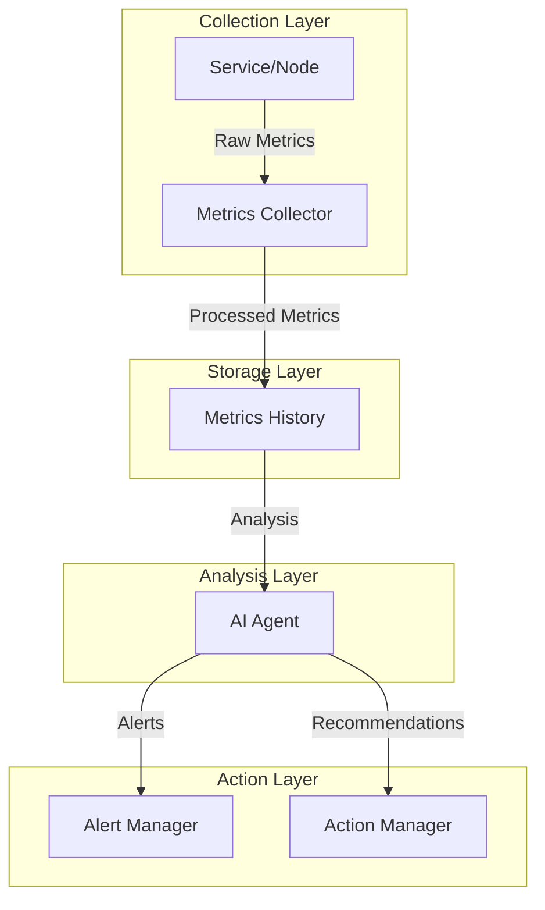
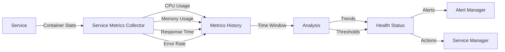
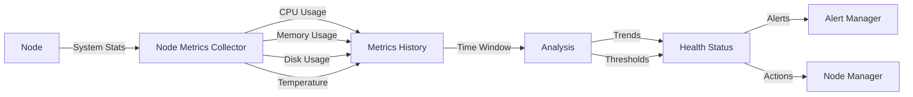
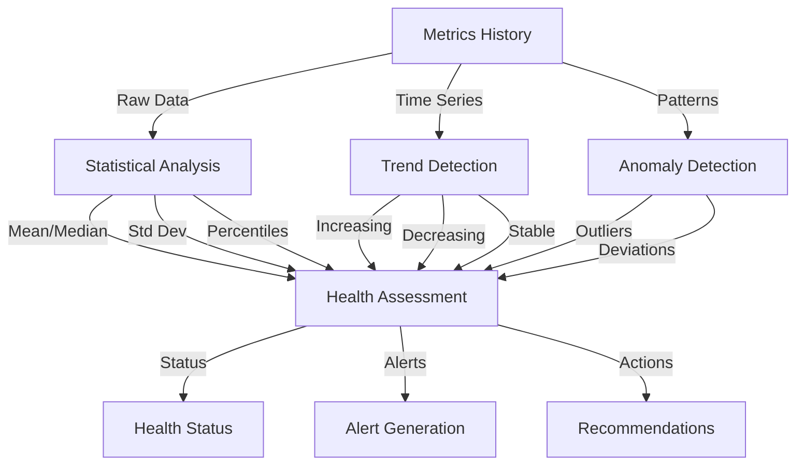
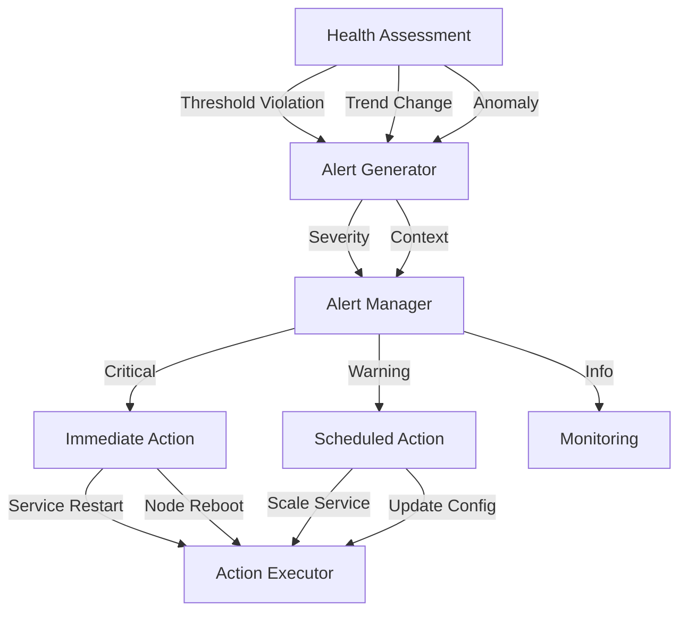
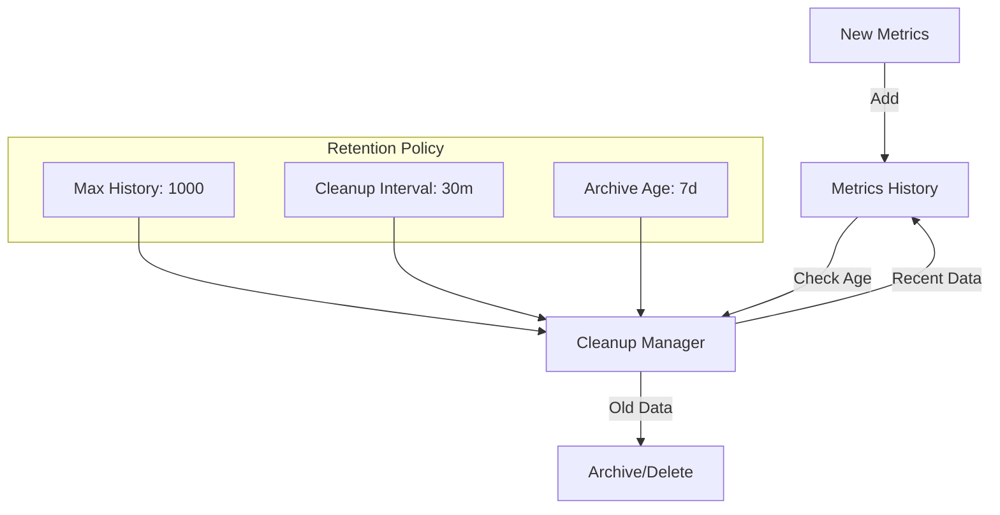
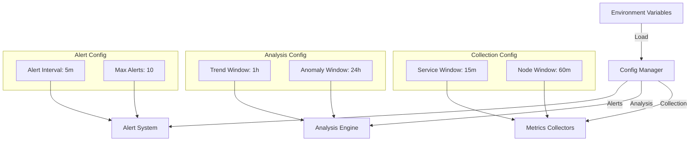

# Metrics Flow Diagrams

This document provides visual representations of how metrics flow through the Open Horizon AI Integration Framework.

## Metrics Collection Flow

## Service Metrics Flow

## Node Metrics Flow

## Metrics Analysis Flow

## Alert Generation Flow

## Data Retention Flow

## Configuration Flow

These diagrams illustrate:
1. How metrics are collected from services and nodes
2. How metrics flow through the system
3. How analysis is performed on the metrics
4. How alerts are generated and managed
5. How data retention works
6. How configuration flows through the system

Each diagram shows a different aspect of the metrics system, making it easier to understand the overall architecture and data flow. 